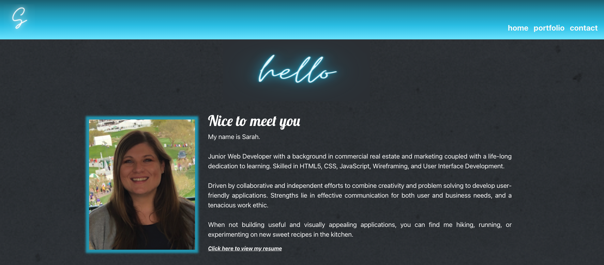

Sarah Bonnell Portfolio

* [Deployed Link](https://bonnell-portfolio.netlify.app/#/)

* [Github Code](https://github.com/sarahbinaz1020/bonnell-portfolio)

## User Story:

* As a user, I would like to look a professional portfolio that has a bio section showing skills and bio. Would also like to see some work that showcases the skills, with links to code and to deployed sites. Finally, would like a contact section to be able to reach out to the individual.  

* This app uses React and Bootstrap.

## Future Development: 

  * Currently working on creating a single project component for all projects using JSON

* (Currently under construction) Contact Form created using Nodemailer and Express, along with OAuth2 for Gmail authentication. 

    * Make sure to set-up OAuth2 configuration on https://console.cloud.google.com/apis & https://developers.google.com/oauthplayground

* Thanks to [Subtle Patterns](https://www.toptal.com/designers/subtlepatterns/) and [Font Awesome](https://fontawesome.com/) for adding design to the site.

  

## Questions

If you have any questions about the repo, open an issue or contact me directly at sarahbinaz1020@gmail.com. You can find more of my work at [Sarah Bonnell](https://github.com/sarahbinaz1020/).